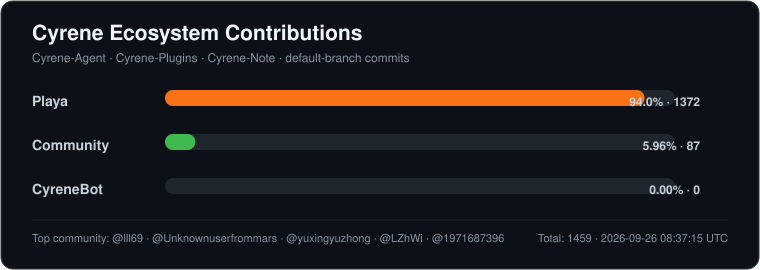

<pre>
 ██████╗██╗   ██╗██████╗ ███████╗███╗   ██╗███████╗
██╔════╝╚██╗ ██╔╝██╔══██╗██╔════╝████╗  ██║██╔════╝
██║      ╚████╔╝ ██████╔╝█████╗  ██╔██╗ ██║█████╗
██║       ╚██╔╝  ██╔══██╗██╔══╝  ██║╚██╗██║██╔══╝
╚██████╗   ██║   ██║  ██║███████╗██║ ╚████║███████╗
 ╚═════╝   ╚═╝   ╚═╝  ╚═╝╚══════╝╚═╝  ╚═══╝╚══════╝
</pre>

  <a href="./README.md">English</a> · <strong>中文</strong>

### Agent · 配套应用 · 生态

**Cyrene 的项目之家。**

Cyrene-Agent，以及围绕 Cyrene 构建的一切。

---

## 🌸 关于 Cyrene

**Playa-Cyrene** 是整个 **Cyrene 生态** 的 GitHub 项目集合与维护主页。

项目以 **Cyrene-Agent** 为核心，并围绕 Cyrene 持续维护配套应用、插件、工具、集成与其他相关项目。

Cyrene 由 **Playa** 独立创作并主要负责开发与维护，同时也接受并感谢来自社区的贡献。

**CyreneBot** 是用于项目自动化及相关任务的机器人账号。

> **一个生态，一个重心：Cyrene。**

---

## ✨ 项目

### 🌸 [Cyrene-Agent](https://github.com/Playa-Cyrene/Cyrene-Agent)

**Cyrene 生态的核心。**

以 Cyrene（昔涟）为核心角色的 Windows Live2D AI 桌面伴侣，整合角色化对话、长期记忆、Agent 工具调用、语音交互、插件系统与多平台接入等能力。

### 🧩 [Cyrene-Plugins](https://github.com/Playa-Cyrene/Cyrene-Plugins)

**Cyrene 的官方插件生态。**

用于收录、审核与分发 Cyrene 插件，同时提供插件示例、社区扩展及基于 Cyrene Plugin SDK 构建的各类集成。

### 📝 [Cyrene-Note](https://github.com/Playa-Cyrene/Cyrene-Note)

**为 Cyrene 打造的本地知识与笔记配套应用。**

围绕 Cyrene-Agent 的 Learn 模式与共享 Vault 工作流设计的本地 Markdown 笔记软件。

---

## 🛠️ 主要技术栈

以上技术构成了目前 Cyrene 生态的主要工程技术栈。

### 🤖 AI 辅助开发

这些是 **Playa** 在 Cyrene 生态开发过程中主要用于辅助研发、代码审查、调试与迭代的 AI 模型家族。

> 本节描述的是 **开发过程中使用的辅助模型**，并不代表、更不限制 Cyrene 本身所支持的 AI 模型与服务商范围。

---

## 📊 贡献概览

  

  统计范围：Cyrene-Agent · Cyrene-Plugins · Cyrene-Note，并由自动化任务持续更新。

---

## 👤 维护者

**Playa** — Cyrene 的创作者与主要维护者。  
**CyreneBot** — 服务于 Cyrene 生态的自动化与机器人账号。

欢迎社区参与贡献，尤其是 Cyrene 的插件生态也离不开社区开发者的参与。

---

## ⚠️ 免责声明与版权说明

Playa-Cyrene 及其相关项目均为基于个人兴趣与同人爱好开发的 **非官方同人项目**。

**Cyrene（昔涟）**的角色设定、美术素材、角色形象及相关知识产权均归 **HoYoverse / 米哈游及相关权利方**所有。

本组织及其相关项目与 HoYoverse / 米哈游不存在官方关联、背书或赞助关系。

各仓库采用的开源许可证仅适用于项目原创源代码及符合授权条件的原创内容，不代表对米哈游 / HoYoverse 的角色、美术、商标或其他第三方知识产权进行授权。

如本组织或相关项目中的任何内容可能涉及侵权、版权或其他权利问题，请通过以下邮箱联系：

### 📧 版权 / 权利问题联系邮箱

**[ky2569ly@gmail.com](mailto:ky2569ly@gmail.com)**

---

**围绕 Cyrene 构建，也认真维护 Cyrene。**

Playa-Cyrene

